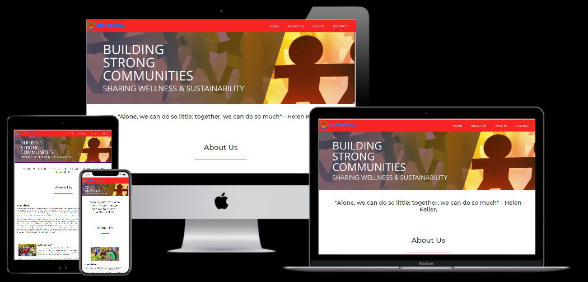

<h1 align="center">Community Wellness</h1>

Milestone project 1: User-Centric Frontend Development - Code Institute

[View the project here.](https://johnnyferns14.github.io/my-first-project/)

<h2 align="center"></h2>

## User Experience (UX)

-   ### User stories

    -   As a user of the website,
        1. I want to easily understand the main purpose of the site and find information on what activities are undertaken by the organisation. The website has to clearly give an idea of who they are and what they do in order to achieve sustainability.
        2. I want to easily move to different sections of the website and get the information from sections that claim to have the information I need.
        3. I want to make sure I will return to the site in order for me to register and and do what I came here to do in the first place.
        4. I want to sign up to the Newsletter so that I am emailed any major updates and/or changes to the website or organisation.

    -   As a member,
        1. I want to gain more information about the various events that have been undertaken and those that are scheduled for the future.
        2. I want to find the best way to get in contact with the organisation with any questions I may have.
        3. I want to find links where I can be updated regularly.
        4. I want to find if there are any other sources where I can get updated information about the events and activities.

-   ### Design
    - #### Navigation bar
        - The Navigation bar adopted for this website is fixed so that the navigation links are easily accessible from any part of the website.  
    -   #### Colour Scheme
        -   The two main colours used are tomato red, and white. These colors have been chosen since they are quite calm on the eyes and it helps to focus the user attention on what you want to convey to them.
    -   #### Typography
        -   The Montserrat font is the main font used throughout the whole website with Sans Serif as the fallback font in case for any reason the font isn't being imported into the site correctly. Montserrat is a clean font used frequently in programming, so it is both attractive and appropriate.
    -   #### Imagery
        -   The large, hero banner is designed to be striking and catch the user's attention. It also has a modern, energetic aesthetic. The image has been subsequently edited to meet the color scheme adopted in the website.

## Features

-   Responsive on all device sizes

-   Interactive elements

## Technologies Used

### Languages Used

-   [HTML5](https://en.wikipedia.org/wiki/HTML5)
-   [CSS3](https://en.wikipedia.org/wiki/Cascading_Style_Sheets)

### Frameworks, Libraries & Programs Used

1. [Bootstrap 4.4.1:](https://getbootstrap.com/docs/4.4/getting-started/introduction/)
    - Bootstrap was used to assist with the responsiveness and styling of the website.
1. [Google Fonts:](https://fonts.google.com/)
    - Google fonts were used to import the 'Monteserrat' font into the style.css file which is used on all pages throughout the project.
1. [Font Awesome:](https://fontawesome.com/)
    - Font Awesome was used on all pages throughout the website to add icons for aesthetic and UX purposes.
1. [jQuery:](https://jquery.com/)
    - jQuery came with Bootstrap to make the navbar responsive but was also used for the smooth scroll function in JavaScript.
1. [Git](https://git-scm.com/)
    - Git was used for version control by utilizing the Gitpod terminal to commit to Git and Push to GitHub.
1. [GitHub:](https://github.com/)
    - GitHub is used to store the projects code after being pushed from Git.
    - Photoshop was used to create the logo, resizing images and editing photos for the website.
1. [Figma:](https://figma.com/)
    - Figma was used to create the [wireframes](https://www.figma.com/file/d2LUr02eNJamgRxfjXtI28/Untitled?node-id=0%3A1) during the design process. The initial wireframe was created as a starting point and the website was then structured based on user experience.

## Testing

The W3C Markup Validator and W3C CSS Validator Services were used to validate every page of the project to ensure there were no syntax errors in the project.

-   [W3C Markup Validator](https://jigsaw.w3.org/css-validator/#validate_by_input) - [Results](https://johnnyferns14.github.io/my-first-project/assets/images/HTMLValidator.jpg)
-   [W3C CSS Validator](https://jigsaw.w3.org/css-validator/#validate_by_input) - [Results]("./assets/images/CSSValidator.jpg)

### Further Testing

-   The Website was tested on Google Chrome, Firefox & Microsoft Edge browsers.
-   The website was viewed on a variety of devices such as Desktop, Laptop & Samsung S7.
-   A large amount of testing was done to ensure that all pages were linking correctly.
-   Friends and family members were asked to review the site and documentation to point out any bugs and/or user experience issues.

### Known Bugs

- All links will function, but the social media links will open the main page of that particular platform. The "Submit" button has not been assigned any function.

- This site was tested across multiple screen sizes on Chrome, Safari and Internet Explore To ensure compatibility and responsiveness it was also tested on an android based mobile device (OnePlus5). When the webpage is visited on larger screens a blue box is shown on the upper right side of the screen. This will disappear on smaller screens the box is used for direct to call actions and social media. A navigation bar is shown all the time and will transform to an option bar on smaller phone screens.

- The text and card-decks will properly align on every screen size.

## Deployment

### GitHub Pages

This site is hosted using GitHub pages, deployed directly from the master branch. The deployed site will update automatically upon new commits to the master branch. In order for the site to deploy correctly on GitHub pages, the landing page must be named index.html.

To run locally, you can clone this repository directly into the editor of your choice by pasting the link into your terminal. To cut ties with this GitHub repository, type git remote rm origin into the terminal.

## Credits

### Code

-   The full-screen hero image code came from this [Website](http://lauradunkley.com)

-   [Bootstrap4](https://getbootstrap.com/docs/4.4/getting-started/introduction/): Bootstrap Library used throughout the project mainly to make site responsive using the Bootstrap Grid System.

## Setup/Installation Requirements

The webpage does not require any specific installation requirements. All it requires is a desktop, laptop or any mobile device with internet browser - preferably Google Chrome or Firefox.

## Support and contact details

If you come across any issues or have questions, ideas or concerns, please contact me by email at ["my email id"](johnnyferns@gmail.com).  Anyone is welcome to make a contribution to the code.

### Content

-   All content was written by the developer.

### Media

-   All Images were downloaded from the internet.

### Acknowledgements

-   My Mentor for continuous helpful feedback.

